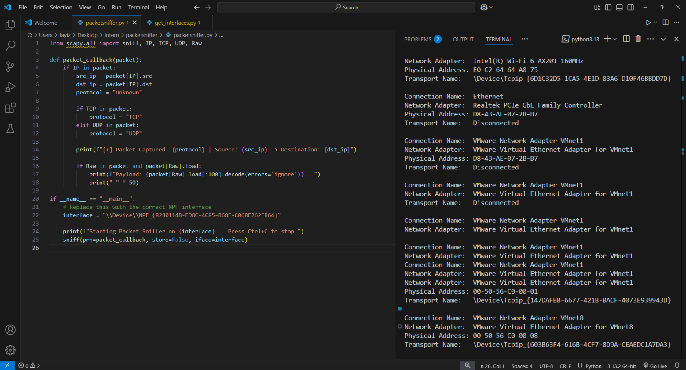
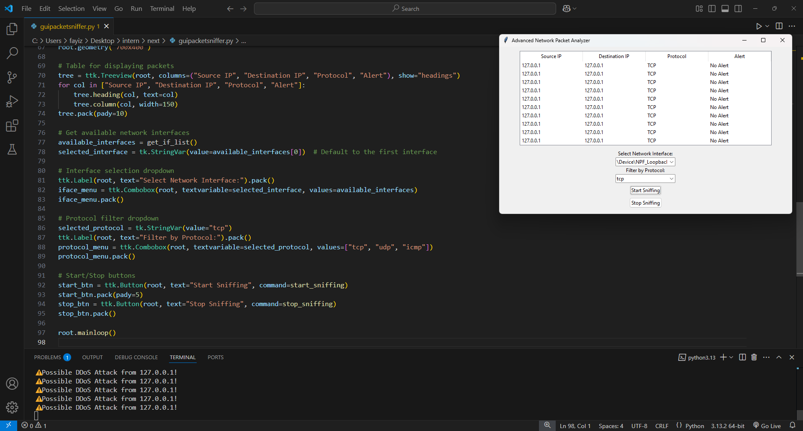

# 🛡️ Advanced Network Packet Analyzer

🔎A powerful GUI-based network packet sniffer that provides:

✅ **Real-time Packet Monitoring**  
✅ **Protocol Filtering (TCP, UDP, ICMP)**  
✅ **Intrusion Detection for DDoS Attacks**  
✅ **User-friendly Interface Selection**  

## 🧿 Features
🔹 **Live Packet Capture & Display**  
🔹 **Suspicious Activity Alerts**  
🔹 **Filter Packets by Protocol**  
🔹 **Interactive GUI Built with Tkinter**  

## 🛠️ Technologies Used
 **Python** |  **Scapy** |  **Tkinter**

## 💻 Installation & Setup
1️⃣ **Clone the Repository**  
   ```bash
   git clone https://github.com/FAYIZ-MP/PRODIGY_CS_05.git
   cd packet-sniffer
   ```
2️⃣ **Install Dependencies**  
   ```bash
   pip install scapy
   ```
3️⃣ **Run the Packet Sniffer**  
   - **Find Available Interfaces**:  
     ```bash
     python get_interfaces.py
     ```
   - **Start the CLI Sniffer**:  
     ```bash
     python packetsniffer.py
     ```
   - **Launch the GUI Sniffer**:  
     ```bash
     python guipacketsniffer.py
     ```

## 📂 Project Structure
📜 `packetsniffer.py` - CLI-based packet sniffer.  
🖥️ `guipacketsniffer.py` - GUI version with alerts.  
🌐 `get_interfaces.py` - Lists available network interfaces.  

## 📸 Preview
**CLI Version:**  
  

**GUI Version:**  
  

## 📜 License
Licensed under the **MIT License**.

## 👨‍💻 About the Developer
Developed by **Fayiz M P**, a passionate **Cybersecurity Engineer & Developer** focused on creating secure and innovative applications.

🔗 [LinkedIn]www.linkedin.com/in/fayiz-m-p-361228295 | [GitHub]https://github.com/FAYIZ-MP


